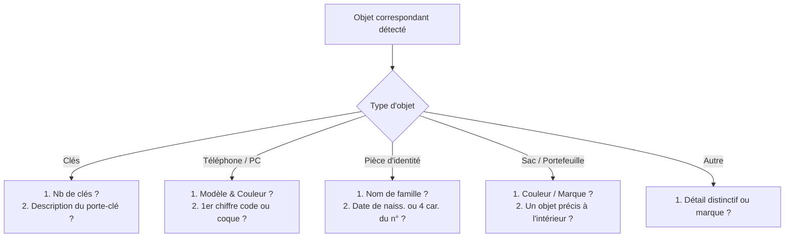

# 📋 Diagnostic et Simplification du Parcours de Vérification & Paiement (Liguita)

---

## 1. 🔍 Pourquoi le bouton « Payer » n'est pas apparu ? (Diagnostic technique)

Lors de votre test sur le trousseau de clés, vous avez répondu aux questions de vérification mais le bouton **« Payer et mettre en relation »** n'est jamais apparu. Voici exactement ce qui s'est passé dans le code :

```
[Utilisateur remplit les questions]
                 │
                 ▼
Vérification : y a-t-il des "réponses secrètes"
enregistrées préalablement par le trouveur ?
       │                              │
     (OUI)                          (NON)
       │                              │
Score auto calculé                    ▼
  ≥ 80% = APPROVED       Statut forcé : UNDER_REVIEW
  < 50% = REJECTED       (En attente manuelle d'un modérateur)
```

1. **Absence de secrets du trouveur** : Le système actuel exige que le trouveur se soit connecté **auparavant** sur la correspondance et ait rempli le formulaire *« Réponses attendues (trouveur) »* pour stocker les bonnes réponses en base (`found_item_secrets`).
2. **Bascule automatique en "UNDER_REVIEW"** : Comme le trouveur n'avait pas encore saisi ces secrets, le serveur applique la règle :
   ```typescript
   if (!hasSecrets) {
     decision = 'UNDER_REVIEW'; // "Réponses enregistrées. Un modérateur va les examiner."
   }
   ```
3. **Condition stricte pour afficher le bouton Payer** :
   Dans `apps/web/src/app/app/correspondances/[id]/page.tsx` (ligne 242) :
   ```tsx
   {item.status === 'CLAIMED' && item.claimStatus === 'APPROVED' ? (
     <button onClick={handleOpenConversation}>
       Payer et mettre en relation
     </button>
   ) : null}
   ```
   Tant qu'un administrateur ne va pas dans le panneau admin pour cliquer sur « Approuver », **le statut reste `UNDER_REVIEW`** et le bouton Payer est **totalement masqué**. L'utilisateur se retrouve dans une impasse.

---

## 2. 🧩 Inadéquation des questions pour les Clés (et autres objets)

Actuellement, les questions sont groupées en 6 grandes familles génériques. Pour les **clés**, le système pioche dans la catégorie `personal` (*Effets personnels*) et impose **5 questions** :

| # | Question posée actuellement | Problème pour des clés |
|---|---|---|
| 1 | *« Décrivez le contenu qui se trouvait à l’intérieur. »* (**Obligatoire**) | ❌ **Absurde** : un trousseau de clés n'a pas d'intérieur ni de contenu. L'utilisateur ne sait pas quoi répondre. |
| 2 | *« Y a-t-il un signe distinctif visible (rayure, tache, autocollant, réparation) ? »* (**Obligatoire**) | ⚠️ Trop générique. |
| 3 | *« Quelle est la couleur dominante de l’objet ? »* (**Obligatoire**) | ⚠️ 90% des clés sont métalliques / argentées / dorées. |
| 4 | *« Quelle marque ou inscription est visible sur l’objet ? »* (Facultatif) | ℹ️ Rarement connue par cœur (Vachette, Bricard, etc.). |
| 5 | *« Combien d’éléments compose l’objet (compartiments, clés, pièces) ? »* (Facultatif) | ℹ️ C'est pourtant **la** vraie question clé, mais elle est facultative et en dernière position. |

---

## 3. 🎯 Parcours Cible Recommandé : Ultra-court & Personnalisé

Pour un service au Tchad (N'Djamena) sur mobile, la vérification doit être **immédiate (30 secondes max)**, avec **1 à 2 questions simples** ciblées selon le type d'objet :

### A. Questions personnalisées par type d'objet (2 questions max)



#### 1. 🔑 Clés (Trousseau, clé de voiture, clé de maison)
1. **Nombre de clés** : Champ numérique simple *(Ex: 3)*.
2. **Porte-clé ou accessoire** : Description courte *(Ex: Cuir marron avec insigne Toyota, ou décapsuleur bleu)*.

#### 2. 📱 Téléphone / Smartphone
1. **Modèle & Coque de protection** *(Ex: Samsung A12, coque transparente avec paillettes)*.
2. **1er chiffre du code de verrouillage OU opérateur de la puce** *(Ex: Code commence par 7, puce Airtel)*.

#### 3. 🪪 Documents officiels (CNI, Permis, Passeport, Diplôme)
1. **Nom et prénom complets inscrits** *(Ex: Mahamat Ahmat)*.
2. **Date de naissance OU 4 derniers chiffres du numéro** *(Ex: 15/04/1998 ou ...3482)*.

#### 4. 👛 Sac / Portefeuille / Bagage
1. **Couleur & Marque / Matière** *(Ex: Sac à dos noir imperméable marque Quechua)*.
2. **Un objet ou document précis qui se trouvait à l'intérieur** *(Ex: Un carnet de santé jaune, un paquet de chewing-gum)*.

---

## 4. 🚀 Comment débloquer le tunnel utilisateur vers le Paiement ?

Le principe de Liguita est de **garantir la sécurité par le séquestre financier et l'OTP de restitution**, et non par un blocage administratif préalable.

### Les 2 options pour rendre le parcours fluide :

### Option 1 (Recommandée : Paiement direct sous séquestre)
1. Le propriétaire répond aux 2 questions rapides.
2. **Le bouton « Payer la mise en relation & récompense » s'affiche immédiatement**.
3. Le propriétaire paie via **Airtel Money**.
4. Les fonds sont **mis sous séquestre sécurisé** chez Liguita.
5. Le trouveur reçoit les réponses du propriétaire et les coordonnées pour le rendez-vous.
6. **Sécurité finale assurée par le code OTP** : Le trouveur ne reçoit sa récompense sur son compte Airtel **que lorsque le propriétaire a récupéré son bien et validé le code secret OTP**.

### Option 2 (Validation directe par le trouveur en 1 clic)
1. Le propriétaire saisit ses 2 réponses.
2. Une notification SMS / notification in-app est envoyée au trouveur :
   > *"Liguita : Le propriétaire présumé indique : 3 clés + porte-clé cuir marron. Est-ce bien votre objet trouvé ? [Confirmer en 1 clic]"*
3. Dès que le trouveur clique sur « Confirmer », le statut passe automatiquement en `APPROVED`.
4. Le bouton « Payer et récupérer » se débloque immédiatement chez le propriétaire.

---

## 5. 📊 Tableau comparatif : Parcours Actuel vs Parcours Simplifié

| Étape | Parcours Actuel (trop long & bloquant) | Parcours Simplifié Proposé |
|---|---|---|
| **Formulaire** | 5 questions génériques inadaptées (ex: contenu d'une clé). | **2 questions ultra-ciblées** selon l'objet (30 secondes). |
| **Prérequis** | Exige que le trouveur ait saisi des secrets au préalable. | **Aucun prérequis bloquant**. |
| **Validation** | Bloqué en `UNDER_REVIEW` (attend un modérateur). | **Auto-validation** ou validation par le trouveur en 1 clic. |
| **Bouton Payer** | ❌ **Invisible** tant qu'un admin n'a pas validé. | ✅ **Visible immédiatement** après réponse. |
| **Sécurité** | Reposait sur un questionnaire fastidieux. | **Garantie par le séquestre Airtel + le code OTP de restitution**. |

---

## 6. Prochaines étapes suggérées

Si vous validez cette simplification, nous pouvons :
1. **Créer les questions spécifiques par type d'objet** (clés, téléphones, documents, sacs) dans `@liguita/config`.
2. **Rendre le bouton « Payer et mettre en relation » accessible** directement sans attendre une modération manuelle.
3. **Tester de bout en bout** la déclaration, la correspondance, la vérification en 2 questions et le tunnel de paiement Airtel.
